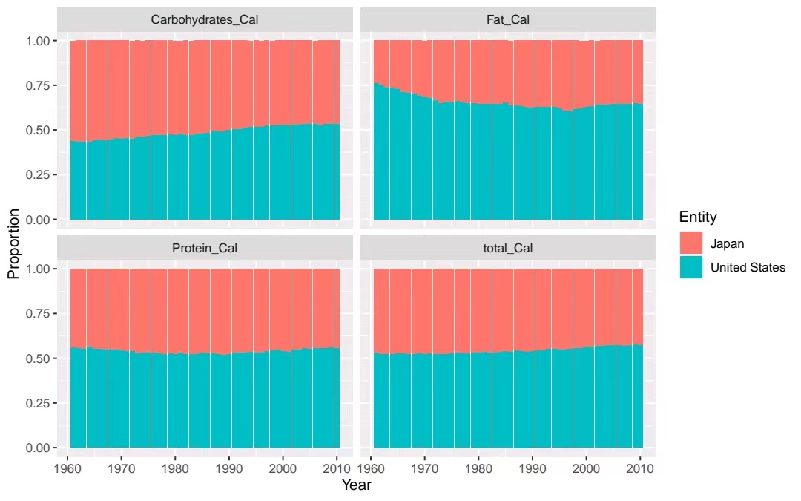
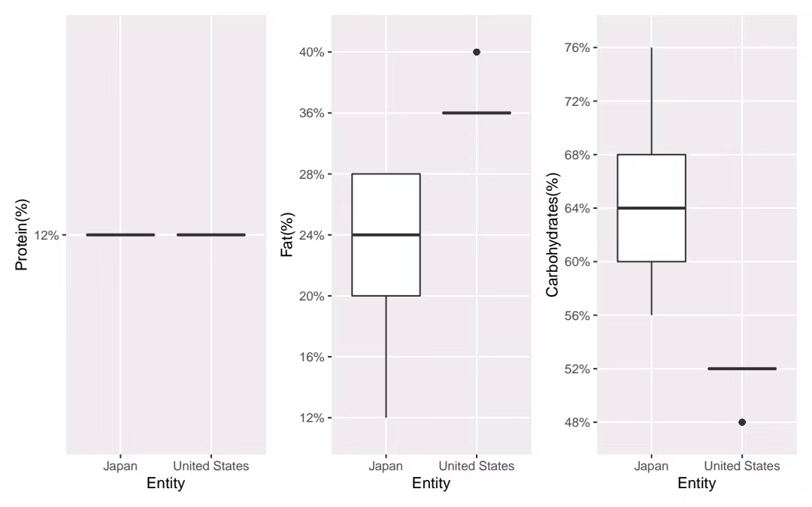

class: left, top

# Question

- .green[ What is the difference in the proportions of total Calories and the three major nutrients (protein, fat, carbohydrate) from 1970 in the American and Japanese diets?]

---

---
# Proportion Share Across The Years

---
# Distribution of Protein,Fat,Carbohydrates

